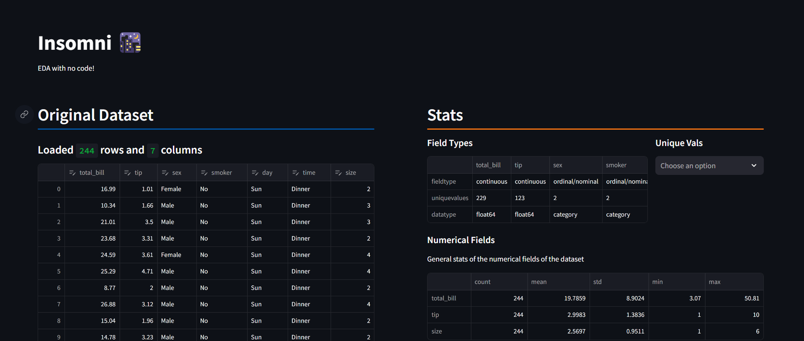
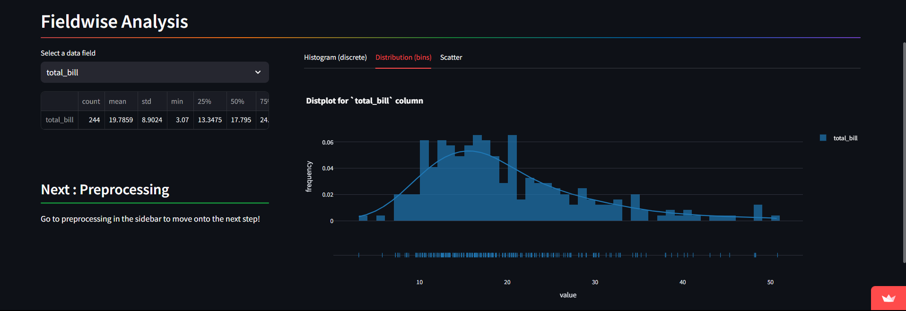
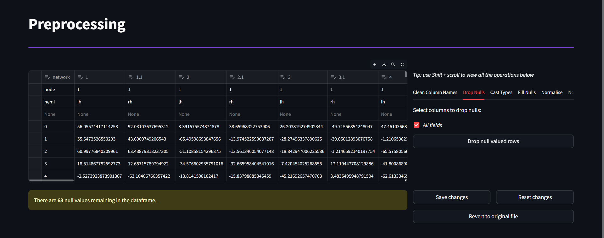
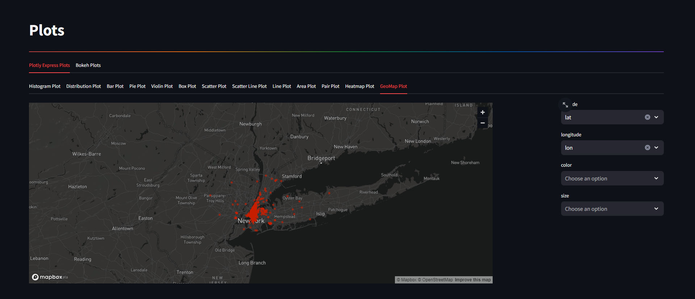

# Insomni 🌃

A [simple, clean webapp](https://insomni.streamlit.app) to perform EDA and data viz on datasets with no code.

[Insomni 🌃](https://insomni.streamlit.app)

View and edit your data:

Columnar data at a glance:

Clean datasets with a few clicks:

Make beautiful and interactive data visualisations:

<!--  -->

<!-- [@StealthyPanda🐼](https://github.com/StealthyPanda)([Personal Page](https://sites.google.com/iitj.ac.in/stealthypanda/home)) -->