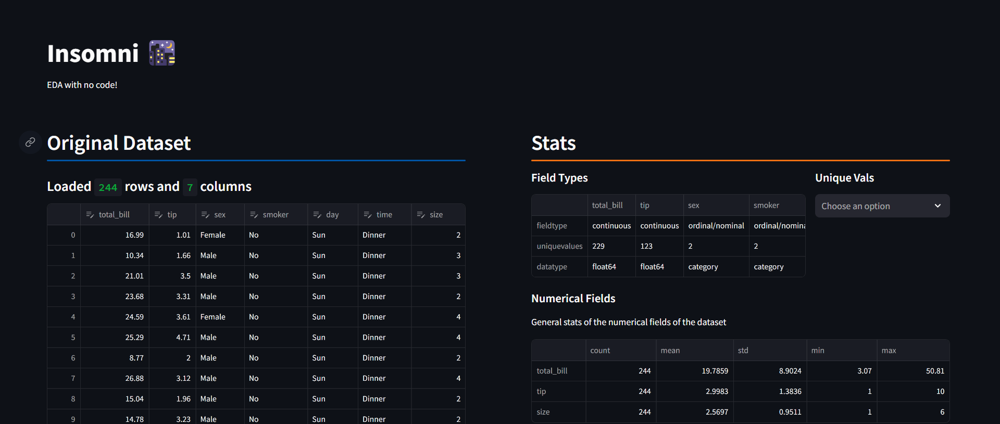
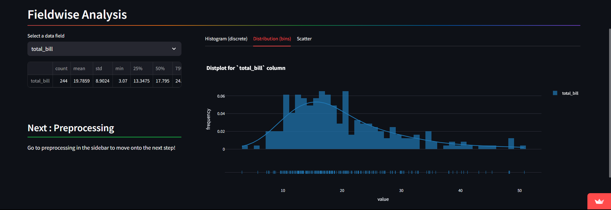
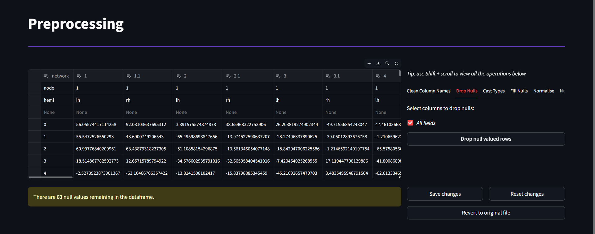
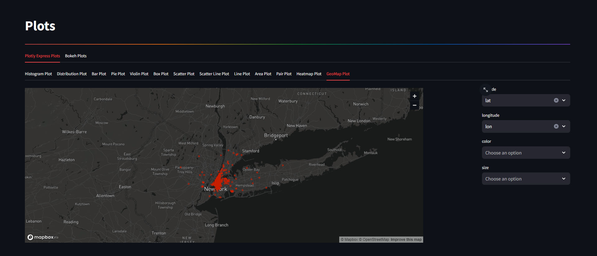

# Insomni 🌃

A [simple, clean webapp](https://insomni.streamlit.app) to perform EDA and data viz on datasets with no code.

[Insomni 🌃](https://insomni.streamlit.app)

View and edit your data:

 

Columnar data at a glance:

 

Clean datasets with a few clicks:

 

Make beautiful and interactive data visualisations:

---

